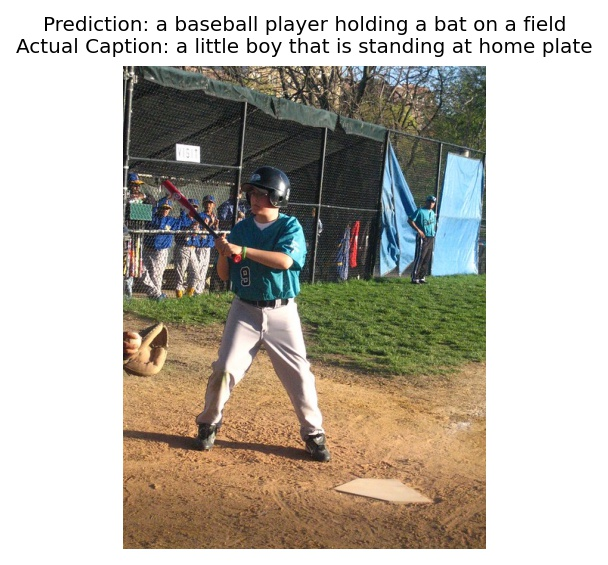
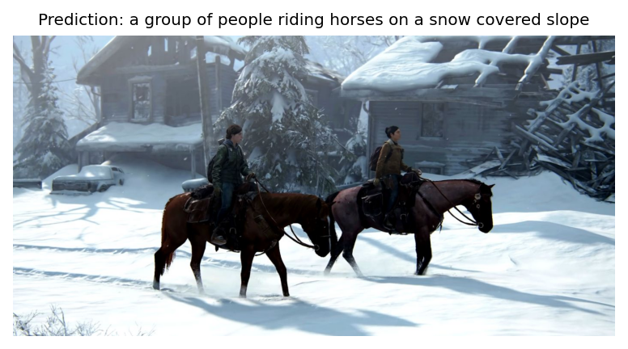
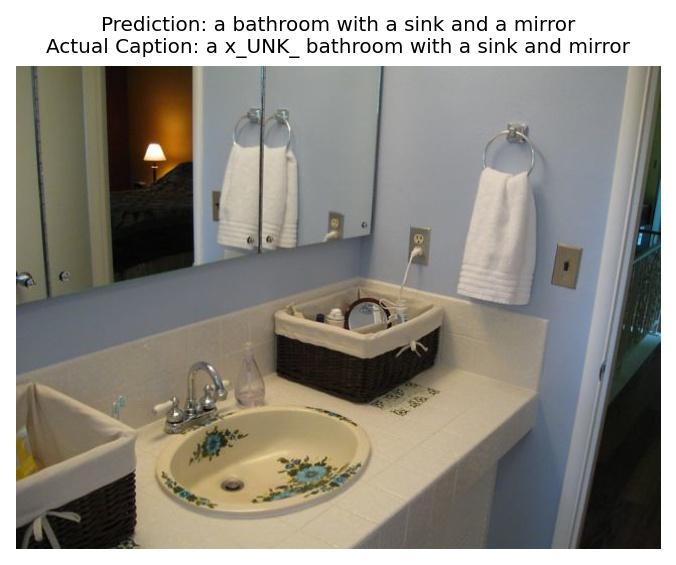

# Image Captioning using Deep Learning (EEE443 - Neural Networks Term Project)

### **Group Members**

* Berfin Kavşut
* Beste Aydemir
* Ege Ozan Özyedek

### **Abstract**

Image captioning task is generating a sequence of appropriate words for a given image. With recent advancements in neural networks, there has been a progress in implement- ing image captioning. Neural network architectures containing Convolutional Neural Networks (CNNs) and Recurrent Neural Networks (RNNs) are utilized to create captions that capture information about the contents of an image. In this project, various architectures were applied using TensorFlow Keras in order to compare their image captioning performances. Instances of Merge, Par-Inject, Pre-Inject and Init-Inject models and their modified versions along with one Bidirectional Multimodal Model were implemented. Model losses and training times were used to compare learning and computational performances. Also, evaluation metrics were calculated to measure aptness of generated captions to reference captions in the dataset. Moreover, sample images were examined to understand the performances further. Analyses of the results provide a general comparison of various models and suggest that implemented models can provide acceptable captions to images.

### **Model Performances**

            Model              BLEU-1     BLEU-2     BLEU-3     BLEU-4     METEOR    ROGUE_L     CIDEr
  -------------------------- ---------- ---------- ---------- ---------- ---------- ---------- ----------
          Core Merge            68.6       49.9       34.5       23.8       27.5       49.4       87.4
       Core Par-Inject          66.9       48.0       32.6     **22.4**     27.4     **48.0**     80.8
       Core Pre-Inject          68.7     **50.5**   **35.1**   **24.4**   **28.3**   **49.7**   **89.3**
       Core Init-Inject         68.8       50.3       34.8       24.1       27.4       49.6       88.6
        Modified Merge        **69.0**   **50.5**     34.7       23.6       28.2       49.3       84.1
     Modified Par-Inject      **66.8**   **47.9**   **32.7**     22.5     **25.6**     48.2     **80.2**
     Modified Pre-Inject        68.0       49.8       34.7       24.2       27.1       49.2       85.5
     Modified Init-Inject       68.1       49.7       34.5       24.0     **25.6**     49.4       86.6
     Bidirectional Multimodal     68.1       49.3       34.1       23.6       27.6       49.5       85.6
   

### **Example Captions**

